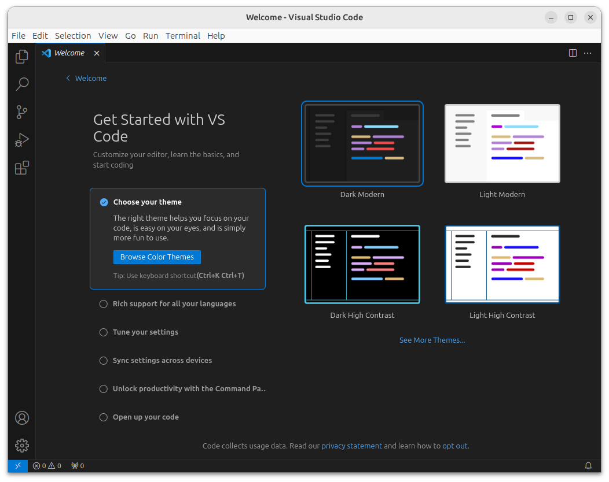
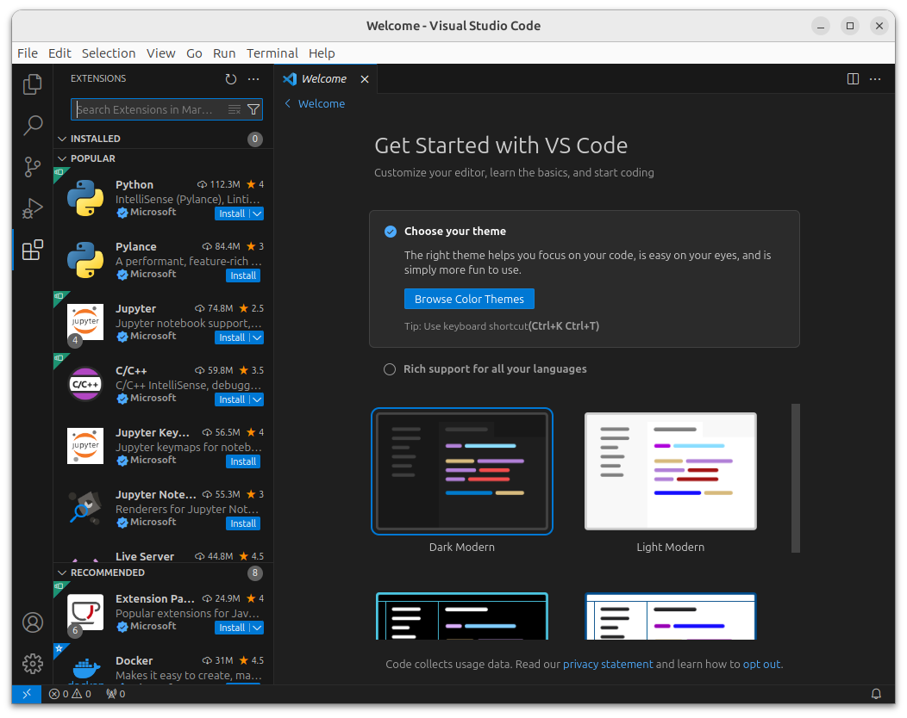

# OceanDSL Python-based DSL Implementation

## Name

oceandsl-languages

## Description

This project contains multiple DSLs for ocean and earth system models.

- CP-DSL including Declaration-DSL, Configuration-DSL and Template-DSL
- TDD-DSL testing DSL for test-driven development
- BGC-DSL language to specify biogeochemical models

Documentation including the languages and architecture can be found in the `doc`.

## License

Apache 2.0

## Install

The OceanDSL DSLs all are based on Python and the provided instructions in the 
readmes uses VSCode. We will add instructions for Emacs and Vi at a later date.

In case you do not want to use VSCode, you can skip *npm*, *node* and *VSCode* 
installation instructions.

### Install Python

The OceanDSL languages are based on python3.

Install Python in Ubuntu with:

`sudo apt install python3 python3-pip`

In some distributions *python3* uses the executable name *python3* leaving
*python* for *python2*. As the following instructions use *python*, you have
either to substitute the names accordingly or in Ubuntu install the following
package:

`sudo apt install python-is-python3`

Install the virtual environment. This helps to keep your distribution
Python setup and the setup for the DSLs separate.

`sudo apt install python3-virtualenv`

Alternatively, you can install the packages via *pip*. Howver, this does
not work in Ubuntu, as it manages its packages via apt/dpkg.

`python -m pip install --upgrade pip setuptools wheel`

Check whether *virtualenv* is installed:

`python -m pip show virtualenv`

This should result in
```
Name: virtualenv
Version: 20.24.1+ds
Summary: Virtual Python Environment builder
Home-page: 
Author: 
Author-email: 
License: 
Location: /usr/lib/python3/dist-packages
Requires: distlib, filelock, platformdirs
Required-by:
```

If missing install it:

`python -m pip install virtualenv`

### Install LSP Server Dependencies

For this how to, we assume that you install your virtual environment in your
home directory. You can, however, install it anywhere. Be sure to adjust paths accordingly.

`cd $HOME`

Generate virtual environment in directory `.venv` using the standard
library `venv` or use the tool `virtualenv`.

Using `venv`:

`python -m venv .venv`

Using `virtualenv`:

`virtualenv .venv`

Activate virtual environment `.venv`

`source .venv/bin/activate`

This will result in the following output:
```
(.venv) user@hostname:~$ 
```
Where `user` will be your username and `hostname` will be the name of your computer.

Install `antlr4-python3-runtime`, `Jinja2`, `mock`, `pygls` and `pytest`
package into virtual environment `.venv`

`python -m pip install antlr4-python3-runtime Jinja2 mock pygls pytest`

The last line of this operation should look like this:
```
Successfully installed Jinja2-3.1.3 MarkupSafe-2.1.5 antlr4-python3-runtime-4.13.1 attrs-23.2.0 cattrs-23.2.3 iniconfig-2.0.0 lsprotocol-2023.0.1 mock-5.1.0 packaging-23.2 pluggy-1.4.0 pygls-1.3.0 pytest-8.0.0
```

The version numbers reflect the state of these packages while writing this documentation. They may differ in future.

## Update npm and node

In case you want to use VSCode as editor, you need JavaScript.
Therefore, install and update JavaScript package manager which is used by VSCode.

`sudo apt install npm`

Check `npm` version

`npm --version`

Outputs, e.g., 10.4.0 or a later version

In case the package is not up-to-date, install latest `npm` version globally
(`-g` or `--global`)

sudo npm install -g npm@latest`

Output:
```
changed 14 packages in 1s

24 packages are looking for funding
  run `npm fund` for details
```
Depending on your installation, the numbers may differ.

Install latest `node` version

`sudo n latest`

Output:
```
  copying : node/21.6.1
installed : v21.6.1 (with npm 10.2.4)
```

The version numbers may differ in your installation.

Install the dependencies to the global mode (`-g` or `--global`)

`sudo npm update -g`

Output:
```
removed 25 packages, and changed 47 packages in 1s

24 packages are looking for funding
  run `npm fund` for details
```
The version numbers may differ in your installation.

### Install and setup VScode

Install VScode in Ubuntu:

`$ sudo apt install code`

### Install Python extensions in VSCode

Start VScode by typing:

`$ code`



You can no choose a theme, if you like.

Click on *extensions*. This is the icon on the left made out of squares. If
unsure hover with the mouse over the icons on the left until you find extensions.

Search for the Python plugin as depicted in the screenshot below.
You can either browse the list or type the name in the search field at the top.



